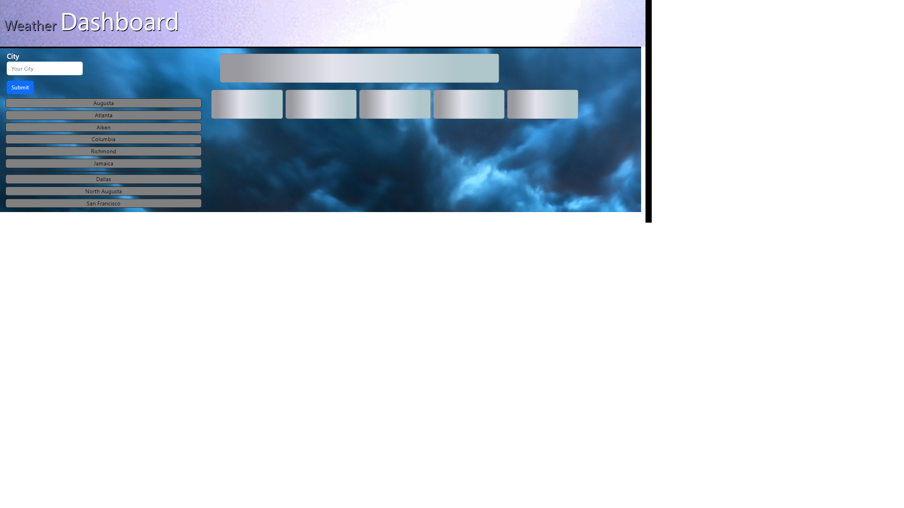

# Created Weather Dashboard
## Created a weather app which displays current and 5-day forecast

In order to better assist customers in identifying weather information, a weather dashboard was created which provides a 5 day forecast as well as the current weather.

## Installation

N/A

## Usage

This site offers the user the ability to input a city name to a weather dashboard and return the current weather as well as the 5 day forecast. Additionally, the user can view past searches and quickly choose the weather based on those searches.

## License

This project uses a MIT license.

